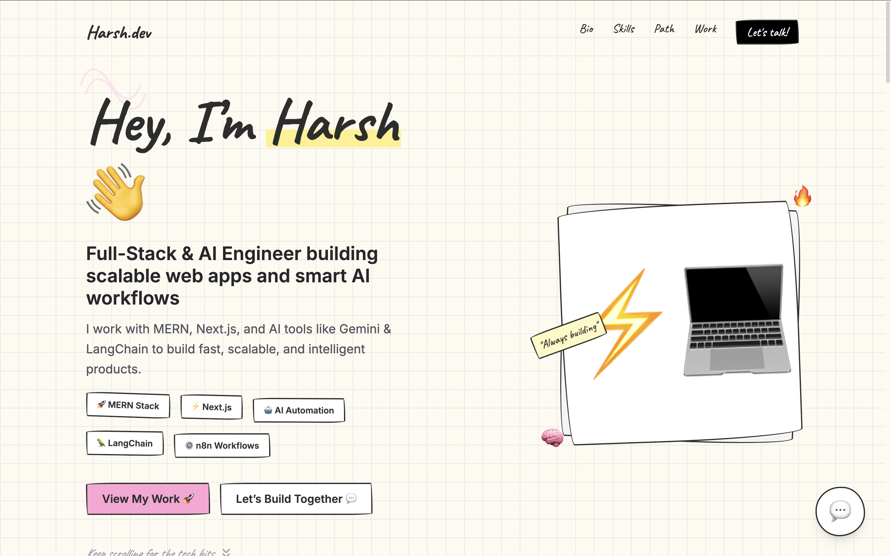

# Portfolio Template — Sketchpad / Notebook Theme

This repository is a public portfolio template with a friendly sketchpad / notebook UI. Use it freely to build your own portfolio or to learn from the design and code.



There are two ready-to-use variants in this repo:

- Next.js (React) version — built with the App Router and components under `app/` and `components/`.
- Static HTML version — a single-page static `index.html` that mirrors the same sketchpad look.

Short overview
- Next.js version: dynamic routes, componentized UI, and a data-driven projects list (`data/projects.js`). Use this if you want a React/SSG/SSR enabled portfolio.
- Static HTML: simple standalone page you can open directly in a browser or serve from any static host.

Quick start — Next.js

1. Install dependencies
```
npm install
```
2. Run dev server
```
npm run dev
```
3. Build for production
```
npm run build
npm run start
```

Where to edit (Next.js)
- Pages and routes: `app/` (the Next.js app router).
- Components: `components/` (UI pieces following the sketchpad theme).
- Project data: `data/projects.js` (each project has a `slug` used by `/projects/[slug]`).
- Styles: `app/globals.css` (theme variables, handwritten fonts, sketch borders, sticky notes, etc.).

Quick start — Static HTML

1. Open `index.html` directly in your browser, or serve it with a simple server:
```
# from repo root
python -m http.server 3000
# or use npm package 'serve'
npx serve .
```
2. Edit `index.html` to change content, doodles, and images.

Assets and images
- Put images under `public/assets/...` (used by Next.js) or reference local paths in `index.html` for the static variant.


If you want, I can:
- Wire gallery cards to project detail pages (`/projects/[slug]`).
- Replace placeholder images with real screenshots from `/public/assets/...`.
- Add a LICENSE file (e.g., MIT) if you want an explicit license.
